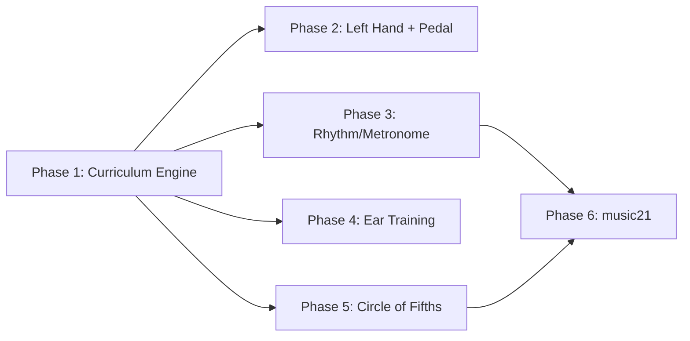

# Multi-Phase Implementation Plan

> Six phases, each self-contained and shippable. Later phases build on earlier ones but each phase delivers working features.

---

## Phase 1 — Curriculum Engine Foundation

**Goal:** Replace the monolithic lesson generator with a multi-session curriculum system. The existing lesson flow keeps working, but gains memory across sessions.

### Files

#### [NEW] `src/logic/services/curriculum_service.py`
- `CurriculumService(QObject)` — owns long-term learning state
- `plan_session(available_minutes) → SessionPlan` — selects from active milestones across 2-3 tracks + review queue
- `get_curriculum_context() → str` — replaces `get_coach_context()` in Gemini prompt; includes milestone state, recent sessions, Dream Song target
- `complete_exercise(result)` — updates milestone progress, SM-2 review scheduling
- `advance_milestone(track, milestone_id)` — mark complete, unlock next
- Exposes QML properties: `currentMilestones`, `sessionHistory`, `reviewQueueCount`

#### [NEW] `src/resources/curriculum_tracks.json`
- Ordered milestones for all 4 tracks (technique, theory, repertoire, ear)
- Each milestone: `id`, `title`, `track`, `order`, `exercise_types`, `unlock_criteria`
- Technique track: `rh_pentascale_c` → `rh_major_triads` → `rh_minor_triads` → `rh_transitions` → `inversions_intro` → `lh_bass_notes` → `hands_together` → `sustain_direct` → `sustain_legato` → `extended_chords`
- Theory track: `half_steps` → `major_formula` → `minor_formula` → `roman_numerals` → `circle_of_fifths` → `nashville_numbers` → `minor_progressions`
- Repertoire/Ear tracks: initial milestones

#### [MODIFY] `src/logic/services/database_manager.py`
- Add 3 tables: `curriculum_state`, `spaced_repetition`, `session_history` (schemas from earlier plan)
- Add methods: `get_curriculum_state()`, `advance_milestone()`, `schedule_review()`, `get_due_reviews()`, `record_session()`

#### [MODIFY] `src/logic/services/chord_trainer.py`
- `start_lesson_plan()` calls `CurriculumService.plan_session()` instead of building its own prompt
- Refactor Gemini prompt: receives focused curriculum context per block (20-30 steps) instead of asking for 80-150
- `_next_chord()` reports results back to `CurriculumService.complete_exercise()`
- All `_apply_step()` / `_setup_target()` code unchanged — execution layer stays the same

#### [MODIFY] `src/app.py`
- Instantiate `CurriculumService` in `AppState.__init__()`, passing `DatabaseManager`
- Expose to QML as `curriculumService` context property
- Wire to `ChordTrainerService`

#### [MODIFY] `src/ui/LeftSidebar.qml`
- Add curriculum progress section: current milestone per track, review items due

### Verification
- Launch app → "Start Lesson" still generates and plays exercises
- Complete 2 sessions → check console for different curriculum context on 2nd session
- Reset skill matrix → curriculum resets to first milestones
- `sqlite3 userdata.db "SELECT * FROM curriculum_state"` shows milestone rows

---

## Phase 2 — Left Hand, Hands Together, Sustain Pedal

**Goal:** Enable left-hand exercises, hands-together coordination, and sustain pedal drills. Requires MIDI CC capture.

### Files

#### [MODIFY] `src/app.py`
- Add MIDI CC64 capture: parse incoming messages for `0xBn` status byte (control change), forward `controller=64` to AppState
- New signal: `sustainPedalChanged(bool)` — true when CC64 value ≥ 64
- New property: `isSustainPedalDown` for QML binding

#### [MODIFY] `src/logic/services/chord_trainer.py`
- Update Gemini prompt: remove `"hand": "right"` hardcode, allow `"left"` and `"both"`
- New exercise type: `"hands_together"` — expects right-hand chord + left-hand bass note simultaneously
- New exercise type: `"sustain_pedal"` — validates pedal timing: down within 200ms of chord (direct), or play→lift→press within 300ms (legato)
- Add pedal state tracking: `handle_pedal_event(is_down: bool)`, blur detection (two chords under one pedal press)
- Octave clamping for left hand: octave 2-3

#### [MODIFY] `src/ui/ChordTrainerView.qml`
- Hand indicator: show "RH" / "LH" / "BOTH" badge
- Sustain pedal visualization: a "pedal lane" bar that shows when pedal should be down
- Pedal status icon in telemetry zone (lights up when pedal is pressed)

#### [MODIFY] `src/ui/VisualKeyboard.qml` (both copies)
- Split visual: highlight right-hand notes in one color, left-hand in another
- Show bass note target when `exerciseType === "hands_together"`

#### [MODIFY] `src/resources/curriculum_tracks.json`
- Technique milestones already defined in Phase 1 — this phase implements the exercises they reference

### Verification
- Press sustain pedal on Roland → pedal icon lights up in UI
- Generate lesson → some steps have `"hand": "left"` or `"hand": "both"`
- Sustain drill: play chord, press pedal → app validates timing
- Over-pedaling warning: hold pedal down across two different chords → coach warns

---

## Phase 3 — Rhythm & Metronome Integration

**Goal:** Add a steady pulse to exercises so practice happens *in time*, not just "play correct notes."

### Files

#### [NEW] `src/logic/services/metronome_service.py`
- `MetronomeService(QObject)` — BPM-driven tick generator
- Uses `QTimer` or `time.perf_counter()` for accurate timing
- Signals: `tick(beat_num)`, `measureStart()`
- Properties: `bpm`, `isRunning`, `beatsPerMeasure`
- Can emit MIDI clicks via `LowLevelMidiOutput` (channel 10, note 76/77 woodblock)

#### [MODIFY] `src/logic/services/chord_trainer.py`
- New exercise type: `"steady_pulse"` — user plays chord on the beat, scored by timing deviation
- `hold_ms` reinterpreted: instead of "hold for N ms", becomes "hold for N beats at current BPM"
- Track timing accuracy per attempt: `timing_offset_ms` (positive = late, negative = early)
- New Gemini prompt field: `"bpm"` per step or per phase

#### [MODIFY] `src/logic/services/database_manager.py`
- Add `avg_timing_offset_ms` column to `chords` table
- `record_chord_attempt()` accepts optional `timing_offset_ms`

#### [MODIFY] `src/app.py`
- Instantiate `MetronomeService`, wire to `ChordTrainerService`
- Expose to QML

#### [MODIFY] `src/ui/ChordTrainerView.qml`
- Beat indicator: visual pulse on each beat (flash/glow)
- BPM display
- Timing feedback: "On beat ✓" / "Late ⟶" / "⟵ Early"

### Verification
- Start lesson → hear metronome clicks through Roland
- Play chord on beat → "On beat ✓"
- Play chord late → "Late" feedback with ms offset
- Check DB: `avg_timing_offset_ms` populated

---

## Phase 4 — Ear Training & MIDI Output Previews

**Goal:** "Hear it first" — play the target chord through MIDI output before the user plays it. Add basic ear training exercises.

### Files

#### [MODIFY] `src/logic/services/chord_trainer.py`
- New exercise type: `"listen"` — plays a chord via MIDI out, user identifies quality (major/minor/dim)
- Before chord drills: optionally play target chord through `LowLevelMidiOutput` as a preview
- New Gemini prompt option: `"preview_chord": true` on steps that introduce a new chord
- Ear training validation: user taps a button ("Major" / "Minor") — no keyboard input needed

#### [MODIFY] `src/app.py`
- New method: `play_chord(pitches, duration_ms)` — sends Note On for all pitches, schedules Note Off
- Wire to `ChordTrainerService` for preview playback

#### [MODIFY] `src/ui/ChordTrainerView.qml`
- "Listen" mode: show ear icon, hide keyboard target, show "Major / Minor / Dim" buttons
- Preview animation: speaker icon pulses when playing the target chord

#### [MODIFY] `src/resources/curriculum_tracks.json`
- Ear track milestones: `hear_it_first` → `major_minor_recognition` → `chord_quality_id` → `root_id_by_ear`

### Verification
- Start lesson → hear target chord played through Roland before drill
- Ear training exercise: chord plays → tap "Minor" → correct/incorrect feedback
- Ear track milestone advances after enough correct identifications

---

## Phase 5 — Circle of Fifths

**Goal:** Interactive Circle of Fifths QML component with two lesson types and persistent sidebar widget.

### Files

#### [NEW] `src/ui/components/CircleOfFifths.qml`
- QML Canvas-rendered circle: 12 major key segments (outer ring) + 12 minor keys (inner ring)
- Rotatable: user drags to center their chosen key at 12 o'clock
- Segment highlighting: current key, diatonic chords, borrowed chords
- Live MIDI pulse: `midiNoteReceived` signal highlights matching segment
- Color coding: green = diatonic, yellow = borrowed, red = chromatic
- II-V-I stencil overlay: draggable 3-segment "window"

#### [NEW] `src/logic/services/circle_of_fifths_service.py`
- Pure Python data layer (uses music21 if available, fallback hardcoded data)
- `get_key_data(key_name) → {sharps, pitches, diatonic_chords, relative, parallel}`
- `get_diatonic_chords(key_name) → [(numeral, chord_name, quality)]`
- `get_shared_notes(key_a, key_b) → [pitch_names]`

#### [MODIFY] `src/ui/LeftSidebar.qml`
- Embed `CircleOfFifths` as persistent sidebar widget
- Reacts to current exercise key: highlights active key segment
- During progressions: animates chord arcs

#### [MODIFY] `src/logic/services/chord_trainer.py`
- New exercise types: `"key_explorer"` and `"progression_navigator"`
- Key Explorer: validate scale playback against `circle_of_fifths_service.get_key_data()`
- Progression Navigator: animate arcs on the circle as chords are played correctly

#### [MODIFY] `src/resources/curriculum_tracks.json`
- Theory track: `circle_of_fifths` milestone exercises reference new types

### Verification
- Circle visible in sidebar during all exercises
- Play notes → matching segment pulses
- Key Explorer lesson: coach narrates, circle animates, user plays scale
- Progression Navigator: I-V-vi-IV arcs animate as user plays correctly
- Drag-to-transpose: drag stencil, see new chord names

---

## Phase 6 — music21 Integration

**Goal:** Replace hardcoded music theory logic with music21 for key detection, difficulty scoring, Roman numerals, and transposition.

### Files

#### [NEW] `src/logic/services/music_theory_service.py`
- Lazy-loads music21 via `importlib`
- `detect_key(midi_path) → (key_name, confidence)`
- `score_difficulty(midi_path) → float` (1-10 scale)
- `get_roman_numerals(chord_names, key) → [numeral_strings]`
- `transpose_exercise(steps, interval) → transposed_steps`
- `extract_hard_segment(midi_path) → (start_beat, end_beat, difficulty_reason)`
- Fallback: if music21 not installed, existing hardcoded logic still works

#### [MODIFY] `src/logic/services/midi_ingestor.py`
- After parsing MIDI: call `music_theory_service.detect_key()` to auto-detect key
- Store key in song metadata

#### [MODIFY] `src/logic/services/repertoire_crawler.py`
- Use `music_theory_service.score_difficulty()` instead of AI call for difficulty rating

#### [MODIFY] `src/logic/services/chord_trainer.py`
- Use `music_theory_service.get_roman_numerals()` for progression labels
- Use `music_theory_service.transpose_exercise()` for "practice in all 12 keys"
- Enriched Gemini context: include detected key, difficulty score

#### [MODIFY] `src/logic/services/circle_of_fifths_service.py`
- Switch from hardcoded data to music21 API calls when available

### Verification
- Load MIDI file → key auto-detected and shown in UI
- Difficulty score appears on repertoire items
- Progression labels show Roman numerals
- "Transpose" button shifts all exercises to a new key
- `python -c "from music21 import *; print(key.Key('C').sharps)"` confirms music21 installed

---

## Dependencies Between Phases

- **Phase 1 is prerequisite for all others** — it provides the milestone/track system
- **Phases 2-5 are independent** and can proceed in parallel after Phase 1
- **Phase 6 depends on Phase 5** (enriches Circle of Fifths) and benefits from Phase 3 (timing data for difficulty scoring)

## Estimated Effort

| Phase | Files Changed | New Files | Complexity |
|---|---|---|---|
| 1 — Curriculum Engine | 4 | 2 | High — core architecture |
| 2 — Left Hand + Pedal | 4 | 0 | Medium — new exercise logic + CC capture |
| 3 — Rhythm/Metronome | 4 | 1 | Medium — timing engine |
| 4 — Ear Training | 3 | 0 | Low-Medium — MIDI output + simple UI |
| 5 — Circle of Fifths | 3 | 2 | High — QML Canvas + data service |
| 6 — music21 | 4 | 1 | Medium — library integration |
